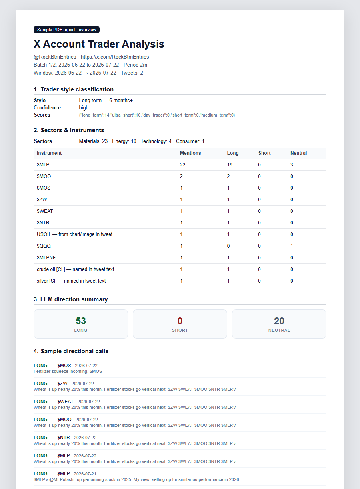
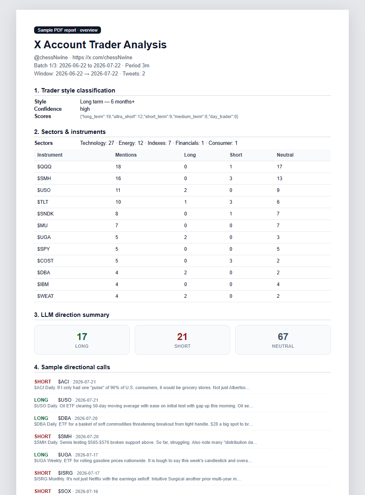
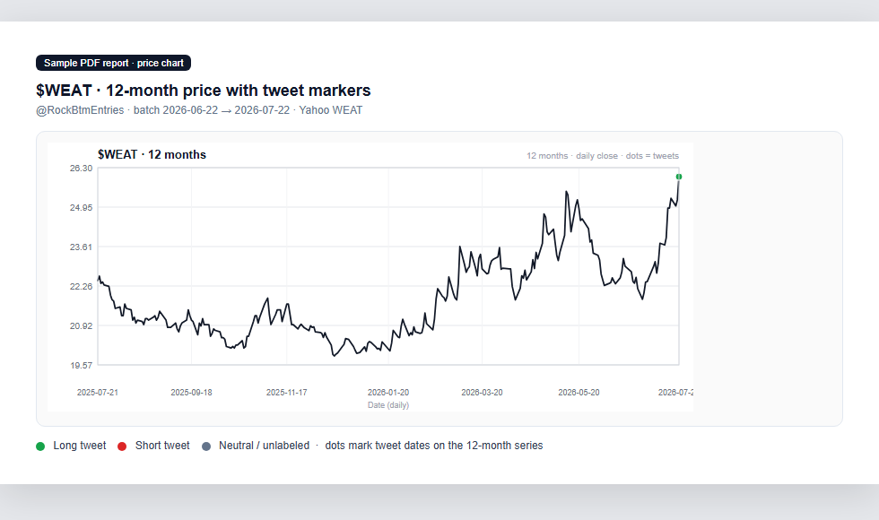
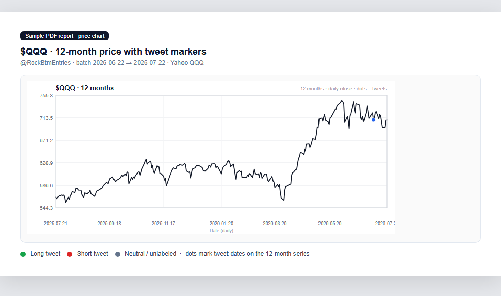
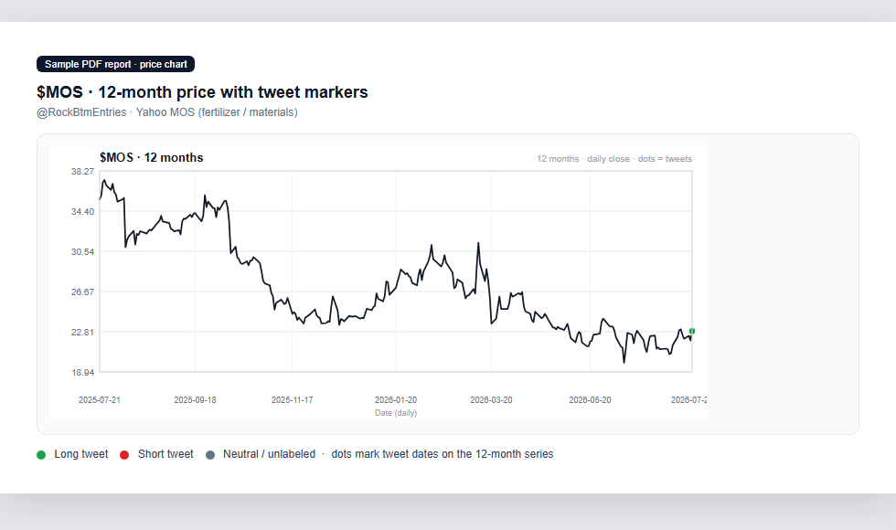

# X Account Fintwit performance checker

Analyze FinTwit (finance Twitter/X) accounts: scrape tweets, extract tickers (stocks **and** crypto), optional LLM Long/Short/Neutral labels, and build **12‑month price charts** with clickable tweet markers — one PDF per month batch.

## Sample report output

Each monthly batch writes a PDF with trader style, instruments, LLM Long/Short/Neutral counts, directional calls, and Yahoo price charts with tweet-date markers.

### Overview page (commodities / equities)

Example from `@RockBtmEntries` — ags, fertilizer, energy, and index mentions:



### Overview page (equities / macro FinTwit)

Example from `@chessNwine`:



### 12-month charts with tweet markers

Green / red / grey dots mark tweet dates on the daily close series (stocks, commodities, and crypto when present).

| `$WEAT` | `$QQQ` |
|---------|--------|
|  |  |

Single-name equities (e.g. fertilizer):



> Screenshots are rendered from real analysis JSON + chart SVGs produced by the tool. Re-generate with `node scripts/render-readme-shots.js` after new runs (requires local `output/` data and Chrome).

## Features

- **Logged-in scrape** via Chrome remote debugging (you log in once; no automated password login)
- **Cashtag-first** extraction (`$SPCX`, `$ETH`, `$PEPE`…) — no invented tickers
- **Crypto + equities** charts via Yahoo Finance (`ETH-USD`, `BTC-USD`, `TAO`, etc.)
- **Optional LLM** direction (xAI / Grok) — **off by default**
- **Multi-month runs** split into ~1‑month batches, each with its own JSON + PDF
- Parent-tweet context for replies; OCR only on likely trading charts

## Setup

```powershell
git clone https://github.com/navneetbindra01-creator/x-account-fintwit-performance-checker.git
cd x-account-fintwit-performance-checker
npm install
```

### Environment

```powershell
copy .env.example .env
# Edit .env and set XAI_API_KEY if you want --llm
```

See [`.env.example`](.env.example) for all placeholders (fake keys only in the template).

### Chrome session (once)

X often blocks login when Playwright launches the browser. Use a normal Chrome profile instead:

```powershell
npm run start-chrome
```

In that Chrome window, log into **x.com**, then leave it open (or close it after login — the session is saved under `chrome-manual-profile/`, which is gitignored).

## Analyze an account

```powershell
# Last ~1 month (default), no LLM
node analyze-account.js --account PeterLBrandt

# Last 3 months, monthly PDFs, LLM Long/Short/Neutral
node analyze-account.js --account RockBtmEntries --period 3m --llm --max-scrolls 150
```

| Flag | Meaning |
|------|---------|
| `--account` / `-a` | X handle (without `@`) |
| `--period` / `-p` | `10d` `30d` `1m` (default) `2m` `3m` `6m` `1y` `3y` |
| `--llm` | Enable xAI direction labels (needs `XAI_API_KEY`) |
| `--no-llm` | Force LLM off |
| `--max-scrolls` | Scroll depth per month window (default 120) |

Outputs land in `output/`:

- `Handle_batch1ofN_YYYY-MM-DD_to_YYYY-MM-DD.pdf`
- matching `.json` snapshots

## Other scripts

| Script | Purpose |
|--------|---------|
| `npm run start-chrome` | Start Chrome with remote debugging + manual profile |
| `npm run search` | Advanced search attach (legacy keyword search helper) |
| `node reanalyze-json.js` | Rebuild PDF/charts from a saved JSON run |
| `node generate-pdf.js` | PDF helper used by the analyzer |

## Project layout

```
analyze-account.js   # main CLI (batch orchestrator)
lib/
  scrape-timeline.js # X advanced search scrape
  extract.js         # tickers, commodities, Yahoo symbol map (incl. crypto)
  llm-direction.js   # optional xAI bulk classification
  price-history.js   # Yahoo daily series
  price-chart.js     # SVG + PDFKit charts with tweet dots
  ...
.env.example         # fake / template env (safe to commit)
```

## Notes

- **Do not commit** `.env`, `chrome-manual-profile/`, or `output/` (see `.gitignore`).
- Crypto Yahoo symbols use `SYMBOL-USD` (and numbered IDs when Yahoo requires them, e.g. PEPE, TAO).
- `$BAND` maps to **Band Protocol** crypto (`BAND-USD`), not Bandwidth Inc.
- LLM is best-effort; empty API responses fall back toward Neutral for that batch.

## License

Private / personal use unless you add a license file.
